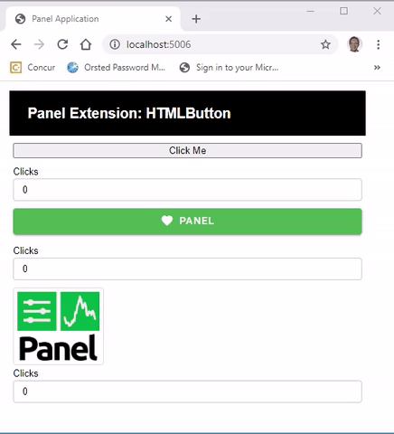
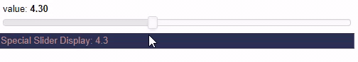
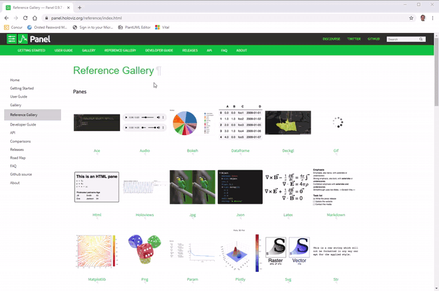

# Bokeh Extensions

**Bokeh Extensions** supports efficient, bidirectional communication from the server (Python) to the browser (Javascript) and back. It also gives you access to all the super powers of modern front end framework languages (js or typescript), tooling and frameworks like React, Vue and Angular. The layouts, panes and widgets that ships with Panel are Bokeh extensions.

Please note that in order for Bokeh Extensions to compile you will need to have [node.js](https://nodejs.org) installed. You can install it directly from their web site or via `conda install -c conda-forge nodejs`.

Before you read on I would ask you to quickly study the offical Bokeh documentation [Extending Bokeh](https://docs.bokeh.org/en/latest/docs/user_guide/extensions.html). You don't need to code and run the examples. After having read the official documentation I hope you have a basic understanding of

- the existence and location of official Bokeh documentation
- what a Bokeh extension is and how it is developed.

We will now focus on Bokeh Extensions for Panel example.

## Example

In this example we will create a Panel `HTMLButton` extension that enables a user
to catch a click event from any HTML element he/ she would like as shown below.

[](https://github.com/MarcSkovMadsen/awesome-panel-extensions/blob/master/examples/guide/html_button/html_button.py)

CLICK ON THE VIDEO TO SEE THE CODE - WALK THROUGH COMING UP

## Other Examples

**Click the images** below to see the code.

[](https://github.com/MarcSkovMadsen/awesome-panel-extensions/blob/master/examples/guide/custom_bokeh_model)

## Official Panel Examples

Every layout, pane or widget in Panel is essentially a Bokeh Extension so a good place to get inspiration is to navigate the [Panel Reference Gallery](https://panel.holoviz.org/reference/index.html) to find an extension similar to the one you would like to implement and then study the code

[](https://panel.holoviz.org/reference/index.html)

You can find the code of the Panel components on Github via

- [Panel Layouts](https://github.com/holoviz/panel/tree/master/panel/layout)
- [Panel Panes](https://github.com/holoviz/panel/tree/master/panel/pane)
- [Panel Widgets](https://github.com/holoviz/panel/tree/master/panel/widgets)

and the underlying Bokeh extensions via

- [Bokeh Model Widgets](https://github.com/bokeh/bokeh/tree/master/bokehjs/src/lib/models/widgets)
- [Panel Bokeh Models](https://github.com/holoviz/panel/tree/master/panel/models)

## Prebuilt Bokeh Extensions

COPY FROM AWESOME-PANEL.ORG REPO - TO BE REVISED

In this document I will describe how I got **prebuilt bokeh model extensions** setup
as a part of the awesome-panel package. I needed it temporarily while waiting for the `WebComponent` PR to be reviewed and released by Panel.

Setting up prebuilt extensions using `Bokeh init --interactive` is briefly described in the Bokeh Docs. See [Bokeh Pre-built extensions](https://docs.bokeh.org/en/latest/docs/user_guide/extensions.html).

I hope this description can help others who would like to create prebuilt custom bokeh models for Bokeh or Panel.

### Steps

I navigated to the root of the awesome-panel package

```bash
cd awesome-panel/package
```

ran `bokeh init --interactive`

```bash
$ bokeh init --interactive
Working directory: C:\repos\private\awesome-panel\package\awesome_panel
Wrote C:\repos\private\awesome-panel\package\awesome_panel\bokeh.ext.json
Create package.json? This will allow you to specify external dependencies. [y/n] y
  What's the extension's name? [awesome_panel]
  What's the extension's version? [0.0.1]
  What's the extension's description? []
Wrote C:\repos\private\awesome-panel\package\awesome_panel\package.json
Create tsconfig.json? This will allow for customized configuration and improved IDE experience. [y/n] y
Wrote C:\repos\private\awesome-panel\package\awesome_panel\tsconfig.json
Created empty index.ts. This is the entry point of your extension.
You can build your extension with bokeh build
All done.
```

In the `package.json` I had to replace

```ts
"dependencies": {
    "bokehjs": "^2.0.2"
  },
```

with

```ts
"dependencies": {
    "@bokeh/bokehjs": "^2.0.2"
  },
```

See [bokeh init issue](https://github.com/bokeh/bokeh/issues/10055).

I also replaced the `tsconfig.json` contents with

```ts
{
  "compilerOptions": {
    "noImplicitAny": true,
    "noImplicitThis": true,
    "noImplicitReturns": true,
    "noUnusedLocals": true,
    "noUnusedParameters": true,
    "strictNullChecks": true,
    "strictBindCallApply": false,
    "strictFunctionTypes": false,
    "strictPropertyInitialization": false,
    "alwaysStrict": true,
    "noErrorTruncation": true,
    "noEmitOnError": false,
    "declaration": true,
    "sourceMap": true,
    "importHelpers": false,
    "experimentalDecorators": true,
    "module": "esnext",
    "moduleResolution": "node",
    "esModuleInterop": true,
    "resolveJsonModule": true,
    "skipLibCheck": true,
    "target": "ES2017",
    "lib": ["es2017", "dom", "dom.iterable"],
    "baseUrl": ".",
    "outDir": "./dist/lib",
    "paths": {
      "@bokehjs/*": [
        "./node_modules/@bokeh/bokehjs/build/js/lib/*",
        "./node_modules/@bokeh/bokehjs/build/js/types/*"
      ]
    }
  },
  "include": ["./**/*.ts"]
}
```

At least including the `path` section is needed to be able to `import { div, label } from "@bokehjs/core/dom"` like @philippjfr does in Panel.

In the `index.ts` file I imported my models

```ts
import * as AwesomePanel from "./express/models/"
export {AwesomePanel}

import {register_models} from "@bokehjs/base"
register_models(AwesomePanel as any)
```

In the `express/models/index.ts` file I exported the `WebComponent`.

```ts
export {WebComponent} from "./web_component"
```

Then I could `build` my extension

```bash
$ panel build
Working directory: C:\repos\private\awesome-panel\package\awesome_panel
Using C:\repos\private\awesome-panel\package\awesome_panel\tsconfig.json
Compiling TypeScript (3 files)
Linking modules
Output written to C:\repos\private\awesome-panel\package\awesome_panel\dist
All done.
```

The result is in the `dist` folder.

I discovered I did not even have to `serve` the `awesome_panel.js` file.

I could just `panel serve` something