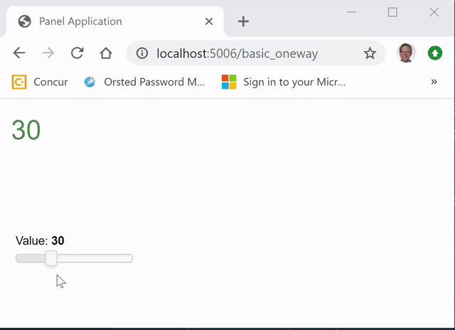
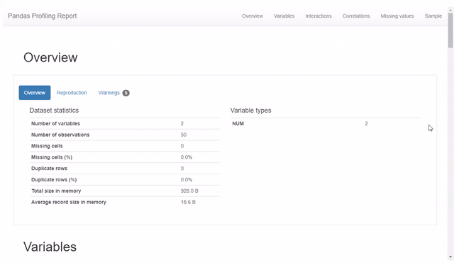

# HTML Extensions

**HTML Extensions** are created by inheriting from the `HTML` pane. You can use HTML, CSS and/ or JS to create amazing extensions to Panel. These extensions cannot communicate from the browser (Javascript) back to the server (Python).

## Example

In this example we will develop a `Dynamic Number` extension that can display a number with the fontsize and green+alpha color ratios depending on the value.

[](https://github.com/MarcSkovMadsen/awesome-panel-extensions/blob/master/examples/guide/dynamic_number.py)

We start by importing the dependencies

```Python
import panel as pn
import param
```

Then we implement the HTML extension.

```python
class DynamicNumber(pn.pane.HTML):
    """Extension Implementation"""
    value = param.Integer(default=30, bounds=(0,100))

    # In order to not be selected by the `pn.panel` selection process
    # Cf. https://github.com/holoviz/panel/issues/1494#issuecomment-663219654
    priority = 0

    def __init__(self, **params):
        # The _rename dict is used to keep track of Panel parameters to sync to Bokeh properties.
        # As value is not a property on the Bokeh model we should set it to None
        self._rename["value"]=None

        super().__init__(**params)
        self._update_object_from_parameters()

    # Don't name the function
    # `_update`, `_update_object`, `_update_model` or `_update_pane`
    # as this will override a function in the parent class.
    @param.depends("value", watch=True)
    def _update_object_from_parameters(self, *events):
        self.object = self._get_html(self.value)

    def _get_html(self, value):
        """Main functionality of Extension"""
        font_size = value
        alpha = 1-value/100
        green = int(value*255/100)
        return f"""
    <div style="font-size: {font_size}px;color: rgba(0,{green},0,{alpha}">{value}</div>
    """
```

Finally we try out the extension

```Python
# Create app
extension = DynamicNumber(width=125, height=125)
app = pn.Column(
    extension,
    extension.param.value,
    width=150,
)
# Serve the app
app.servable()
```

## More Examples

**Click the images** below to see the code.

[](https://github.com/MarcSkovMadsen/awesome-panel-extensions/blob/master/awesome_panel_extensions/panes/pandas_profile_report.py)

## Official Panel Examples

The [Panel Gallery](https://panel.holoviz.org/gallery/index.html) contains more examples in the section called *External libraries*. Please note that these are not implemented by inheriting from the HTML pane. They just use it. It's not difficult to see how the examples could be converted to inheritance examples though.

[](https://panel.holoviz.org/gallery/index.html).