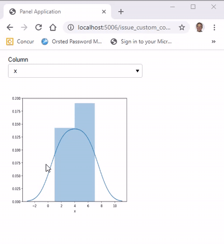

# Layout Extensions

**Layout Extensions** are created by inheriting from a layout. The extensions developed is composed of panes, layouts and widgets. The extension developed is often a widget and not a layout.

## Example

In this example we will inherit from `panel.Column`. We will develop a `DataFramePlotter` extension that enables a Panel user to select a column of a given DataFrame and see the associated `distplot`.

[](https://github.com/MarcSkovMadsen/awesome-panel-extensions/blob/master/examples/guide/dataframe_plotter.py)

We start by importing the requirements

```python
import matplotlib.pyplot as plt
import pandas as pd
import panel as pn
import param
import seaborn as sns
```

Then we implement the *Layout Extension*.

```python
class DataFramePlotter(pn.Column):
    """Extension Implementation"""
    column = param.Selector()

    def __init__(self, data, **params):
        # The _rename dict is used to keep track of Panel parameters to sync to Bokeh properties.
        # As column is not a property on the Bokeh model we should set it to None
        self._rename["column"] = None

        super().__init__(**params)

        self._plot_pane = pn.pane.Matplotlib(background="blue", sizing_mode="stretch_both")
        self[:] = [self.param.column, self._plot_pane]

        # Please note that the alternative of setting
        # @param.depends("column", watch=True)
        # on _update_plot_pane does not work.
        # See https://github.com/holoviz/panel/issues/1060
        self.param.watch(self._update_plot_pane, "column")

        columns = data.columns.values
        self.param.column.objects = columns
        # I need to set self.column to show a plot initially
        self.column = columns[0]

    def _update_plot_pane(self, _):
        # - I get exception if plt.close is below ax line. See https://github.com/holoviz/panel/issues/1482
        # - The plot does not change if I remove plot.close() fully.
        plt.close()

        ax = sns.distplot(df[self.column])
        self._plot_pane.object = ax.figure
```

Finally we can use the extension.

```python
df = pd.DataFrame(data={"x": [1, 2, 3, 4, 5, 6, 7], "y": [1, 2, 2, 4, 5, 9, 7]})
DataFramePlotter(df, width=300, height=300).servable()
```

## More Examples

**Click the images** below to see the code.

COMING UP

## Official Panel Examples

COMING UP