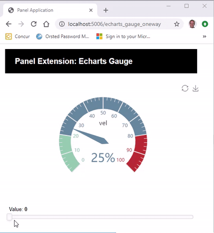

# View Extensions

**View Extensions** are `param.Parameterized` classes with a `view` attribute or function. View Extensions are developed almost in the same way as **Inheritance Extensions**. Their api is different though. You use `ViewExtension().view` to view a View Extension and `InheritanceExtension()` to view an Inheritance Extension.

View extensions avoids some of the technical quirks that the Inheritance Extensions comes with at the cost of having to communicate to users they need to append `.view` to view the extension.

## Example

In this example we will develop a `Dynamic Number` extension that can display a number with the fontsize and green+alpha color ratios depending on the value.

[](https://github.com/MarcSkovMadsen/awesome-panel-extensions/blob/master/examples/guide/dynamic_number.py)

We start by importing the dependencies

```Python
import panel as pn
import param
```

Then we implement the View extension.

```python
class DynamicNumber(param.Parameterized):
    """Extension Implementation"""
    value = param.Integer(default=30, bounds=(0,100))
    view = param.ClassSelector(class_=pn.layout.Reactive)

    def __init__(self, **params):
        super().__init__(**params)
        self.view = pn.pane.HTML()
        self._update_object()

    @param.depends("value", watch=True)
    def _update_object(self, *events):
        self.view.object = self._get_html(self.value)

    def _get_html(self, value):
        """Main functionality of Extension"""
        font_size = value
        alpha = 1-value/100
        green = int(value*255/100)
        return f"""
    <div style="font-size: {font_size}px;color: rgba(0,{green},0,{alpha}">{value}</div>
    """
```

Finally we try out the extension

```Python
# Create app
extension = DynamicNumber()
extension.view.width=125
extension.view.height=125
app = pn.Column(
    extension.view,
    extension.param.value,
    width=150,
)
# Serve the app
app.servable()
```

If you compare this example to corresponding `HTML` Extension example you will notice that

- Developing the `DynamicNumber` class has fewer lines and is less quirky.
- Using the `DynamicNumber` class uses more lines and is a bit more quirky.

So the question really is. Should you make it easier for the developer or the user of the extension? In the first case you would develop it as a View Extension in the Second as a HTML extension.

If you have an opinion please join the discussions

- [Discourse - How to create a self-contained, custom "Panel"?](https://discourse.holoviz.org/t/how-to-create-a-self-contained-custom-panel/985/6)
- [Github - Document subclassing of different component types](https://github.com/holoviz/panel/issues/1494)
- [Github - Please support concept of HTML Extension](https://github.com/holoviz/panel/issues/1483)
- [Github - Please support concept of Layout Extension](https://github.com/holoviz/panel/issues/1072)

## More Examples

**Click the images** below to see the code.

[](https://github.com/MarcSkovMadsen/awesome-panel-extensions/blob/master/examples/guide/echarts_gauge_oneway.py)

## Official Panel Examples

The [Panel Gallery](https://panel.holoviz.org/gallery/index.html) contains more examples in the section called *External libraries*.

[](https://panel.holoviz.org/gallery/index.html).