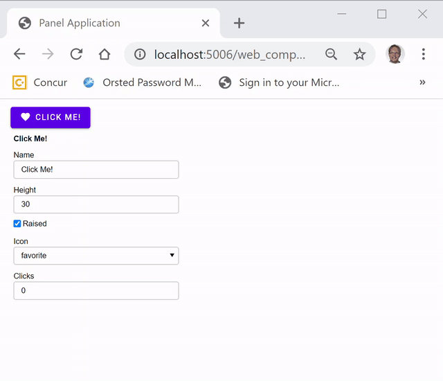

# WebComponent Extensions

You can think of the `WebComponent` pane as **a `HTML` pane that supports bidirectional communication and large data transfer**. You can use the `WebComponent` to quickly **plugin web component or javascript libraries**.

For example you can use the `WebComponent` pane to plug in your favourite set of widgets. For example if the `DataFrame` pane or widget is not enough for your use case, then plugin an alternative grid.

For an introduction to *web components* see [Web Components: the secret ingredient helping Power the web](https://www.youtube.com/watch?v=YBwgkr_Sbx0).

<a href="https://www.youtube.com/watch?v=YBwgkr_Sbx0" target="blank_"></img></a>

The `WebComponent` is currently distributed via the `awesome-panel-extensions` package. But it is also on the **roadmap for Panel**. So we need your help to identify bugs and improvements or suggestions for improving the api. You can contribute your comments and suggestions via [Github PR 1252](https://github.com/holoviz/panel/pull/1252).

## Example

In this example we will develop a [mwc-button](https://github.com/material-components/material-components-web-components/tree/master/packages/button). It's based on the Material Design Specification and is a part of the [MWC library](https://github.com/material-components/material-components-web-components) of layouts and widgets.

You will need to install the required packages via `pip install panel param awesome-panel-extensions`.

We will start by importing the dependencies

```python
import panel as pn
import param
from awesome_panel_extensions.pane import WebComponent
```

Then we define the `MWCButton`.

```python
MWC_ICONS = [None, "accessibility", "code", "favorite"]

class MWCButton(WebComponent):
    html = param.String("<mwc-button></mwc-button")
    attributes_to_watch = param.Dict({"label": "name", "icon": "icon", "raised":"raised"})
    events_to_watch = param.Dict({"click": "clicks"})

    raised=param.Boolean(default=True)
    icon=param.ObjectSelector(default="favorite", objects=MWC_ICONS, allow_None=True)
    clicks = param.Integer()

    height = param.Integer(default=30)

mwc_button = MWCButton(name="Click Me!")
```

The key part to notice is that we configure the `label`, `icon` and `raised` attributes of the `mwc-button` to the `name`, `icon` and `raised` parameters of the `MWCButton`.

The we need to include the `.js` and `.css` files needed for the `mwc-button`. Currently `panel.extension` does not support importing `module` `.js` files. So we just use an invisible `HTML` pane.

```python
MWC_EXTENSIONS = """
<script type='module' src='https://www.unpkg.com/@material/mwc-button?module'></script>
<link href='https://fonts.googleapis.com/css?family=Roboto:300,400,500' rel='stylesheet'>
<link href='https://fonts.googleapis.com/css?family=Material+Icons&display=block' rel='stylesheet'>
<style>
:root {
    --mdc-theme-primary: green;
    --mdc-theme-secondary: purple*;
}
</style>
"""
extensions_pane = pn.pane.Markdown(MWC_EXTENSIONS, height=0, width=0, sizing_mode="fixed", margin=0)
```

Then we define the app

```python
settings_pane = pn.Param(
    mwc_button, parameters=["name", "icon", "raised", "height", "clicks"]
)
app = pn.Column(
    extensions_pane, mwc_button, settings_pane
)
app.servable()
```

and finally we can `panel serve` the app.



## Reference Guide

Click the links below to get a deeper understanding of the `WebComponent`.

[](https://mybinder.org/v2/gh/MarcSkovMadsen/awesome-panel-extensions/master?filepath=examples%2Freference%2Fpanes%2FWebComponent.ipynb) [](https://nbviewer.jupyter.org/github/MarcSkovMadsen/awesome-panel-extensions/blob/master/examples/reference/panes/WebComponent.ipynb)

## More Examples

COMING UP