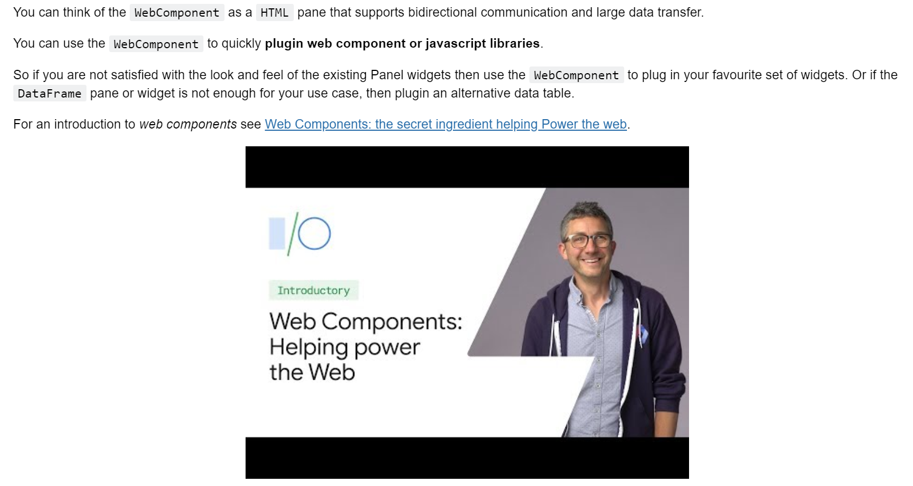
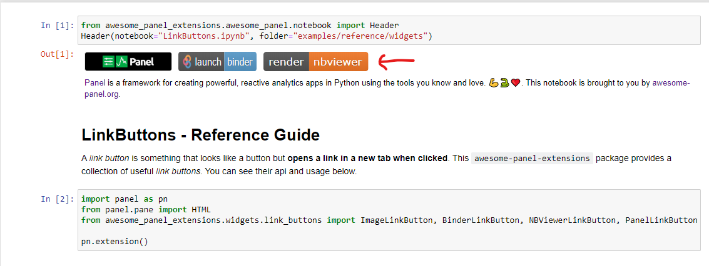
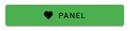

# Awesome Panel Extensions Package

The Awesome Panel Extensions package contains Panel Extensions that add to the power of Panel.

## Installation

You can install the package via

```python
pip install awesome-panel-extensions
```

Each individual extension might depend on additional packages. For example the `awesome_panel_extensions.panes.PandasProfileReport` depends on the [Pandas Profiling](https://github.com/pandas-profiling/pandas-profiling) package.

## Reference Gallery

Check out the extensions by clicking the images below.

### Panes

#### PandasProfileReport

[](https://mybinder.org/v2/gh/MarcSkovMadsen/awesome-panel-extensions/master?filepath=examples%2Freference%2Fpanes%2FPandasProfileReport.ipynb) [](https://nbviewer.jupyter.org/github/MarcSkovMadsen/awesome-panel-extensions/blob/master/examples/reference/panes/PandasProfileReport.ipynb)

[](https://github.com/MarcSkovMadsen/awesome-panel-extensions/blob/master/examples/reference/panes/PandasProfileReport.ipynb)

#### WebComponent

[](https://mybinder.org/v2/gh/MarcSkovMadsen/awesome-panel-extensions/master?filepath=examples%2Freference%2Fpanes%2FWebComponent.ipynb) [](https://nbviewer.jupyter.org/github/MarcSkovMadsen/awesome-panel-extensions/blob/master/examples/reference/panes/WebComponent.ipynb)

[](https://mybinder.org/v2/gh/marcskovmadsen/awesome-panel-extensions/master?filepath=examples%2Freference%2Fpanes%2FWebComponent.ipynb)

### Widgets

#### LinkButtons

[](https://mybinder.org/v2/gh/MarcSkovMadsen/awesome-panel-extensions/master?filepath=examples%2Freference%2Fwidgets%2FLinkButtons.ipynb) [](https://nbviewer.jupyter.org/github/MarcSkovMadsen/awesome-panel-extensions/blob/master/examples/reference/widgets/Linkbuttons.ipynb)

[](https://mybinder.org/v2/gh/marcskovmadsen/awesome-panel-extensions/master?filepath=examples%2Freference%2Fwidgets%2FLinkButtons.ipynb)

#### PerspectiveViewer

The `PerspectiveViewer` is perfect for interactive, streaming analytics of large amounts of data.

[](https://mybinder.org/v2/gh/MarcSkovMadsen/awesome-panel-extensions/master?filepath=examples%2Freference%2Fwidgets%2FPerspectiveViewer.ipynb) [](https://nbviewer.jupyter.org/github/MarcSkovMadsen/awesome-panel-extensions/blob/master/examples/reference/widgets/PerspectiveViewer.ipynb)

[](https://mybinder.org/v2/gh/marcskovmadsen/awesome-panel-extensions/master?filepath=examples%2Freference%2Fwidgets%2FPerspectiveViewer.ipynb)

### Frameworks

#### Material

The Material Extensions are based on the [MWC Material Web Components](https://github.com/material-components/material-components-web-components) and [Material Design](https://material.io/design).

Please note that the Material Widgets **do not work in older browsers** like Internet Explorer.

#### Material Button

[](https://mybinder.org/v2/gh/MarcSkovMadsen/awesome-panel-extensions/master?filepath=examples%2Freference%2Fframeworks%2Fmaterial%2FMaterialButton.ipynb) [](https://nbviewer.jupyter.org/github/MarcSkovMadsen/awesome-panel-extensions/blob/master/examples/reference/frameworks/material/MaterialButton.ipynb)

[](https://mybinder.org/v2/gh/marcskovmadsen/awesome-panel-extensions/master?filepath=examples%2Freference%2Fframeworks%2Fmaterial%2FMaterialButton.ipynb)

#### Developer Tools

##### Awesome Panel Designer

The *Awesome Panel Designer* is my attempt to create an **efficient workflow for data exploration and development of data apps** in Python **from an editor or IDE**.

This is for **developing any Python object that Panel can display**:

- Strings, Markdown, HTML/ Css/ Javascript
- DataFrames
- Matplotlib, Vega/ Altair, ECharts, Deck.gl, Bokeh, Plotly, HvPlot/ HoloViews, ...
- Panel layouts, widgets, extensions and apps

For more info click the link below.

* [Awesome Panel Designer Docs](designer.md)

