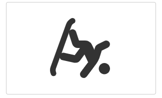
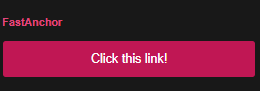
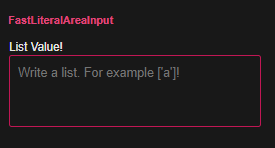
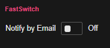
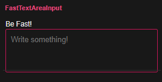
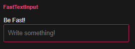
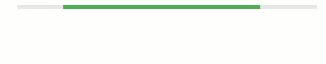
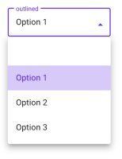

# Awesome Panel Extensions Package

The Awesome Panel Extensions package contains Panel Extensions that add to the power of Panel.

## Installation

You can install the package via

```python
pip install awesome-panel-extensions
```

Each individual extension might depend on additional packages. For example the `awesome_panel_extensions.panes.PandasProfileReport` depends on the [Pandas Profiling](https://github.com/pandas-profiling/pandas-profiling) package.

## Reference Gallery

Check out the extensions by clicking the images below.

### Models

#### Icon

Use it via `from awesome_panel_extensions.models import Icon`.

[](https://mybinder.org/v2/gh/MarcSkovMadsen/awesome-panel-extensions/master?filepath=examples%2Freference%2Fmodels%2FIcon.ipynb) [](https://nbviewer.jupyter.org/github/MarcSkovMadsen/awesome-panel-extensions/blob/master/examples/reference/models/Icon.ipynb)

[](https://github.com/MarcSkovMadsen/awesome-panel-extensions/blob/master/examples/reference/models/Icon.ipynb)

#### Panes

#### PandasProfileReport

Use it via `from awesome_panel_extensions.pane import PandasProfileReport`.

[](https://mybinder.org/v2/gh/MarcSkovMadsen/awesome-panel-extensions/master?filepath=examples%2Freference%2Fpanes%2FPandasProfileReport.ipynb) [](https://nbviewer.jupyter.org/github/MarcSkovMadsen/awesome-panel-extensions/blob/master/examples/reference/panes/PandasProfileReport.ipynb)

[](https://github.com/MarcSkovMadsen/awesome-panel-extensions/blob/master/examples/reference/panes/PandasProfileReport.ipynb)


#### WebComponent

Use it via `from awesome_panel_extensions.web_component import WebComponent`.

[](https://mybinder.org/v2/gh/MarcSkovMadsen/awesome-panel-extensions/master?filepath=examples%2Freference%2Fpanes%2FWebComponent.ipynb) [](https://nbviewer.jupyter.org/github/MarcSkovMadsen/awesome-panel-extensions/blob/master/examples/reference/panes/WebComponent.ipynb)

You can think of the `WebComponent` as a `HTML` pane that supports bidirectional communication and large data transfer.

You can use the `WebComponent` to quickly **plugin web component or javascript libraries**.

So if you are not satisfied with the look and feel of the existing Panel widgets then use the `WebComponent` to plug in your favourite set of widgets. Or if the `DataFrame` pane or widget is not enough for your use case, then plugin an alternative data table.

For an introduction to *web components* see [Web Components: the secret ingredient helping Power the web](https://www.youtube.com/watch?v=YBwgkr_Sbx0).

<a href="https://www.youtube.com/watch?v=YBwgkr_Sbx0" target="blank_"></img></a>


### Widgets

#### LinkButtons

Use them via `from awesome_panel_extensions.widgets import link_buttons`.

[](https://mybinder.org/v2/gh/marcskovmadsen/awesome-panel-extensions/master?filepath=examples%2Freference%2Fwidgets%2FLinkButtons.ipynb) [](https://nbviewer.jupyter.org/github/marcskovmadsen/awesome-panel-extensions/blob/master/examples/reference/widgets/LinkButtons.ipynb)

[](https://nbviewer.jupyter.org/github/marcskovmadsen/awesome-panel-extensions/blob/master/examples/reference/widgets/LinkButtons.ipynb)


#### PivotTable

The `PivotTable` is a nice, interactive widget for getting insights from data.

Use it via `from awesome_panel_extensions.widgets.pivot_table import PivotTable`

[](https://mybinder.org/v2/gh/MarcSkovMadsen/awesome-panel-extensions/master?filepath=examples%2Freference%2Fwidgets%2FPivotTable.ipynb) [](https://nbviewer.jupyter.org/github/MarcSkovMadsen/awesome-panel-extensions/blob/master/examples/reference/widgets/PivotTable.ipynb)

<video style="max-width:100%;max-height:500px;" autoplay controls>
  <source src="https://raw.githubusercontent.com/MarcSkovMadsen/awesome-panel/master/docs/packages/awesome-panel-extensions/pivot-table.mp4" type="video/mp4" controls>
    You browser does not support video
</video>

### Frameworks

#### Fast

The Fast extensions are based on the [fast.design](https://fast.design/) web components web component which are open sourced by Microsoft and probably will power the VS Code and Microsoft Office experience in the future.

[](https://fast.design/)

Please note that you can only use the Fast components inside a custom Panel template that

- Loads the  [Fast `javascript` library](https://www.fast.design/docs/components/getting-started#from-cdn).
- Wraps the content of the `<body>` html tag inside the [fast-design-system-provider](https://www.fast.design/docs/components/getting-started#add-components) tag.

We provide the `FastTemplate` for easy usage.

You can also develop your own custom [Panel template](https://panel.holoviz.org/user_guide/Templates.html) if you need something special. For example combining it with more [fast.design](https://fast.design/) web components and the [Fluent Design System](https://www.microsoft.com/design/fluent/#/) to create **VS Code** and **Microsoft Office** like experiences.

Please also note that the Fast components do not work on legacy browser like Internet Explorer.

#### FastAnchor

Use it via `from awesome_panel_extensions.frameworks.fast import FastAnchor`

[](https://mybinder.org/v2/gh/MarcSkovMadsen/awesome-panel-extensions/master?filepath=examples%2Freference%2Fframeworks%2Ffast%2FFastAnchor.ipynb) [](https://nbviewer.jupyter.org/github/MarcSkovMadsen/awesome-panel-extensions/blob/master/examples/reference/frameworks/fast/FastAnchor.ipynb)

[](https://mybinder.org/v2/gh/marcskovmadsen/awesome-panel-extensions/master?filepath=examples%2Freference%2Fframeworks%2Ffast%2FFastAnchor.ipynb)

#### FastButton

Use it via `from awesome_panel_extensions.frameworks.fast import FastButton`

[](https://mybinder.org/v2/gh/MarcSkovMadsen/awesome-panel-extensions/master?filepath=examples%2Freference%2Fframeworks%2Ffast%2FFastButton.ipynb) [](https://nbviewer.jupyter.org/github/MarcSkovMadsen/awesome-panel-extensions/blob/master/examples/reference/frameworks/fast/FastButton.ipynb)

[](https://mybinder.org/v2/gh/marcskovmadsen/awesome-panel-extensions/master?filepath=examples%2Freference%2Fframeworks%2Ffast%2FFastButton.ipynb)

#### FastCheckbox

Use it via `from awesome_panel_extensions.frameworks.fast import FastCheckbox`

[](https://mybinder.org/v2/gh/MarcSkovMadsen/awesome-panel-extensions/master?filepath=examples%2Freference%2Fframeworks%2Ffast%2FFastCheckbox.ipynb) [](https://nbviewer.jupyter.org/github/MarcSkovMadsen/awesome-panel-extensions/blob/master/examples/reference/frameworks/fast/FastCheckbox.ipynb)

[](https://mybinder.org/v2/gh/marcskovmadsen/awesome-panel-extensions/master?filepath=examples%2Freference%2Fframeworks%2Ffast%2FFastCheckbox.ipynb)


#### FastLiteralAreaInput

Use it via `from awesome_panel_extensions.frameworks.fast import FastLiteralAreaInput`

[](https://mybinder.org/v2/gh/MarcSkovMadsen/awesome-panel-extensions/master?filepath=examples%2Freference%2Fframeworks%2Ffast%2FFastLiteralAreaInput.ipynb) [](https://nbviewer.jupyter.org/github/MarcSkovMadsen/awesome-panel-extensions/blob/master/examples/reference/frameworks/fast/FastLiteralAreaInput.ipynb)

[](https://mybinder.org/v2/gh/marcskovmadsen/awesome-panel-extensions/master?filepath=examples%2Freference%2Fframeworks%2Ffast%2FFastLiteralAreaInput.ipynb)

#### FastLiteralInput

Use it via `from awesome_panel_extensions.frameworks.fast import FastLiteralInput`

[](https://mybinder.org/v2/gh/MarcSkovMadsen/awesome-panel-extensions/master?filepath=examples%2Freference%2Fframeworks%2Ffast%2FFastLiteralInput.ipynb) [](https://nbviewer.jupyter.org/github/MarcSkovMadsen/awesome-panel-extensions/blob/master/examples/reference/frameworks/fast/FastLiteralInput.ipynb)

[](https://mybinder.org/v2/gh/marcskovmadsen/awesome-panel-extensions/master?filepath=examples%2Freference%2Fframeworks%2Ffast%2FFastLiteralInput.ipynb)

#### FastSwitch

Use it via `from awesome_panel_extensions.frameworks.fast import FastSwitch`

[](https://mybinder.org/v2/gh/MarcSkovMadsen/awesome-panel-extensions/master?filepath=examples%2Freference%2Fframeworks%2Ffast%2FFastSwitch.ipynb) [](https://nbviewer.jupyter.org/github/MarcSkovMadsen/awesome-panel-extensions/blob/master/examples/reference/frameworks/fast/FastSwitch.ipynb)

[](https://mybinder.org/v2/gh/marcskovmadsen/awesome-panel-extensions/master?filepath=examples%2Freference%2Fframeworks%2Ffast%2FFastSwitch.ipynb)

#### FastTextAreaInput

Use it via `from awesome_panel_extensions.frameworks.fast import FastTextAreaInput`

[](https://mybinder.org/v2/gh/MarcSkovMadsen/awesome-panel-extensions/master?filepath=examples%2Freference%2Fframeworks%2Ffast%2FFastTextAreaInput.ipynb) [](https://nbviewer.jupyter.org/github/MarcSkovMadsen/awesome-panel-extensions/blob/master/examples/reference/frameworks/fast/FastTextAreaInput.ipynb)

[](https://mybinder.org/v2/gh/marcskovmadsen/awesome-panel-extensions/master?filepath=examples%2Freference%2Fframeworks%2Ffast%2FFastTextAreaInput.ipynb)

#### FastTextInput

Use it via `from awesome_panel_extensions.frameworks.fast import FastTextInput`

[](https://mybinder.org/v2/gh/MarcSkovMadsen/awesome-panel-extensions/master?filepath=examples%2Freference%2Fframeworks%2Ffast%2FFastTextInput.ipynb) [](https://nbviewer.jupyter.org/github/MarcSkovMadsen/awesome-panel-extensions/blob/master/examples/reference/frameworks/fast/FastTextInput.ipynb)

[](https://mybinder.org/v2/gh/marcskovmadsen/awesome-panel-extensions/master?filepath=examples%2Freference%2Fframeworks%2Ffast%2FFastTextInput.ipynb)

#### Material

The Material Extensions are based on the [MWC Material Web Components](https://github.com/material-components/material-components-web-components) and [Material Design](https://material.io/design).

Please note that you need to add the Material `Extension` and `Stylesheet` components to you app to setup the js and css requirements.

Please also note that the Material Widgets **do not work in older browsers** like Internet Explorer.

#### Material Button

Use it via `from awesome_panel_extensions.frameworks.material import Button`

[](https://mybinder.org/v2/gh/MarcSkovMadsen/awesome-panel-extensions/master?filepath=examples%2Freference%2Fframeworks%2Fmaterial%2FMaterialButton.ipynb) [](https://nbviewer.jupyter.org/github/MarcSkovMadsen/awesome-panel-extensions/blob/master/examples/reference/frameworks/material/MaterialButton.ipynb)

[](https://mybinder.org/v2/gh/marcskovmadsen/awesome-panel-extensions/master?filepath=examples%2Freference%2Fframeworks%2Fmaterial%2FMaterialButton.ipynb)

#### Material CircularProgress

Use it via `from awesome_panel_extensions.frameworks.material import CircularProgress`.

[](https://mybinder.org/v2/gh/MarcSkovMadsen/awesome-panel-extensions/master?filepath=examples%2Freference%2Fframeworks%2Fmaterial%2FMaterialCircularProgress.ipynb) [](https://nbviewer.jupyter.org/github/MarcSkovMadsen/awesome-panel-extensions/blob/master/examples/reference/frameworks/material/MaterialCircularProgress.ipynb)

[](https://mybinder.org/v2/gh/marcskovmadsen/awesome-panel-extensions/master?filepath=examples%2Freference%2Fframeworks%2Fmaterial%2FMaterialCircularProgress.ipynb)

#### Material IntSlider

[](https://mybinder.org/v2/gh/MarcSkovMadsen/awesome-panel-extensions/master?filepath=examples%2Freference%2Fframeworks%2Fmaterial%2FMaterialIntSlider.ipynb) [](https://nbviewer.jupyter.org/github/MarcSkovMadsen/awesome-panel-extensions/blob/master/examples/reference/frameworks/material/MaterialIntSlider.ipynb)

[](https://mybinder.org/v2/gh/marcskovmadsen/awesome-panel-extensions/master?filepath=examples%2Freference%2Fframeworks%2Fmaterial%2FMaterialIntSlider.ipynb)

Use it via `awesome_panel_extensions.frameworks.material.IntSlider`.


#### Material LinearProgress

Use it via `from awesome_panel_extensions.frameworks.material import LinearProgress`.

[](https://mybinder.org/v2/gh/MarcSkovMadsen/awesome-panel-extensions/master?filepath=examples%2Freference%2Fframeworks%2Fmaterial%2FMaterialLinearProgress.ipynb) [](https://nbviewer.jupyter.org/github/MarcSkovMadsen/awesome-panel-extensions/blob/master/examples/reference/frameworks/material/MaterialLinearProgress.ipynb)

[](https://mybinder.org/v2/gh/marcskovmadsen/awesome-panel-extensions/master?filepath=examples%2Freference%2Fframeworks%2Fmaterial%2FMaterialLinearProgress.ipynb)

#### Material Select

Use it via `from awesome_panel_extensions.frameworks.material import Select`

[](https://mybinder.org/v2/gh/MarcSkovMadsen/awesome-panel-extensions/master?filepath=examples%2Freference%2Fframeworks%2Fmaterial%2FMaterialSelect.ipynb) [](https://nbviewer.jupyter.org/github/MarcSkovMadsen/awesome-panel-extensions/blob/master/examples/reference/frameworks/material/MaterialSelect.ipynb)

[](https://mybinder.org/v2/gh/marcskovmadsen/awesome-panel-extensions/master?filepath=examples%2Freference%2Fframeworks%2Fmaterial%2FMaterialSelect.ipynb)

### Developer Tools

#### Awesome Panel Designer

Use it via `from awesome_panel_extensions.developer_tools.designer import Designer`.

The *Awesome Panel Designer* is my attempt to create an **efficient workflow for data exploration and development of data apps** in Python **from an editor or IDE**.

This is for **developing any Python object that Panel can display**:

- Strings, Markdown, HTML/ Css/ Javascript
- DataFrames
- Matplotlib, Vega/ Altair, ECharts, Deck.gl, Bokeh, Plotly, HvPlot/ HoloViews, ...
- Panel layouts, widgets, extensions and apps

For more info click the link below.

* [Awesome Panel Designer Docs](designer.md)

<video width="640" height="360" poster="__POSTER__.jpg" controls autoplay>
    <source src="https://github.com/MarcSkovMadsen/awesome-panel/blob/master/docs/packages/awesome-panel-extensions/awesome-panel-designer-guide.mp4?raw=true" type="video/mp4" />
</video>
